# Arquitetura, Fluxogramas e Decisões Estratégicas — UNIVASF RAG (v2)

> Documento de apoio para a escrita do TCC II. Consolida, em forma de diagramas e texto corrido, a arquitetura de cada camada do sistema, o comportamento em runtime, as decisões estratégicas tomadas (e por quê) e a metodologia de desenvolvimento aplicada ao longo das 7 fases da v2 (Fases 0-6, ver `EVOLUTION_V2.md` para o registro fase-a-fase completo).
>
> **Nota sobre numeração de decisões:** existem hoje dois conjuntos de decisões numeradas `D1`-`D9` em documentos diferentes deste projeto — os `D1`-`D9` de `EVOLUTION.md` (v1/TCC I: chunking por artigo, busca híbrida, reranker, etc.) e os `D1`-`D9` do **diagnóstico** em `PLANO_V2.md` (staleness do BM25, chunks órfãos, threshold do reranker não usado, etc. — uma lista de problemas encontrados na v1, não decisões da v1). São listas diferentes que coincidem em numeração. Neste documento, cada decisão é identificada pelo **nome descritivo primeiro**; o número (quando existir) vem entre parênteses com a fonte, para não gerar ambiguidade na monografia.

---

## Sumário

0. [Linha do Tempo: da Proposta do TCC I ao Estado Atual](#0-linha-do-tempo-da-proposta-do-tcc-i-ao-estado-atual)
1. [Visão Geral das Camadas](#1-visão-geral-das-camadas)
2. [Metodologia Aplicada](#2-metodologia-aplicada)
3. [Camada 1 — Ingestão de Documentos](#3-camada-1--ingestão-de-documentos)
4. [Camada 2 — Armazenamento](#4-camada-2--armazenamento)
5. [Camada 3 — Recuperação (RAG)](#5-camada-3--recuperação-rag)
6. [Camada 4 — Orquestração do Agente](#6-camada-4--orquestração-do-agente)
7. [Camada 5 — API e Autenticação](#7-camada-5--api-e-autenticação)
8. [Camada 6 — Escopo por Curso](#8-camada-6--escopo-por-curso)
9. [Camada 7 — Infraestrutura e Deploy](#9-camada-7--infraestrutura-e-deploy)
10. [Síntese — Tabela de Decisões Estratégicas](#10-síntese--tabela-de-decisões-estratégicas)
11. [Achado Central — RAG vs. SQL, Validado Empiricamente Três Vezes](#11-achado-central--rag-vs-sql-validado-empiricamente-três-vezes)

---

## 0. Linha do Tempo: da Proposta do TCC I ao Estado Atual

Este projeto passou por três momentos distintos, e a monografia do TCC II ganha em rigor metodológico se eles forem apresentados como o que realmente são: **proposta → MVP real → evolução v2**, com as reduções de escopo e os pivôs técnicos explicitados, não escondidos. Nenhuma dessas mudanças é um problema a esconder — são exatamente o tipo de decisão fundamentada que uma seção de Metodologia/Discussão de TCC deve registrar.

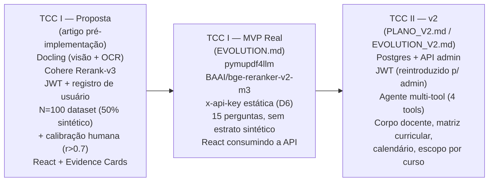

### 0.1 O que foi proposto no artigo do TCC I

O artigo inicial (pré-implementação) descrevia uma arquitetura **Advanced RAG** com cinco etapas: (1) ETL via **Docling** — biblioteca com modelos de visão computacional, capaz de OCR sobre PDFs digitalizados; (2) chunking semântico-hierárquico por regex sobre a estrutura da Lei Complementar 95/1998 (Art./Parágrafo/Inciso), com fallback recursivo para artigos longos; (3) recuperação em funil — pré-filtro de vigência, busca híbrida (BM25 + vetorial), reranking via **Cohere Rerank-v3-multilingual** com corte físico por `score_threshold > 0.4`; (4) geração com GPT-4o (`τ=0`), grounding estrito e citação obrigatória, servida por uma interface **React** com "Cartões de Evidência" (texto original, score de confiança do Cohere, link de proveniência); (5) avaliação via **RAGAS**, com um Golden Dataset de **N=100** perguntas (50% coletadas de alunos/secretários reais, 50% geradas sinteticamente pela técnica *Evolution*) e um protocolo formal de **calibração humana** (30% da amostra, 2 avaliadores, correlação de Pearson `r > 0.7` como critério de validação do juiz sintético). Autenticação seria feita via **JWT com registro de usuário** validado por e-mail `@univasf.edu.br`, com perfis de aluno/professor.

### 0.2 Como de fato ficou o MVP (TCC I real, `EVOLUTION.md`)

Comparado ao artigo, o MVP entregue manteve o núcleo conceitual (chunking por artigo, busca híbrida, reranking, geração com citação) mas **simplificou ou substituiu** vários componentes por decisões pragmáticas, cada uma justificada em `EVOLUTION.md`:

| Componente | Proposto no artigo | Implementado de fato (MVP) |
|---|---|---|
| Conversão PDF → texto | **Docling** (visão computacional + OCR) | **`pymupdf4llm`** — extração direta de texto/estrutura, sem modelo de visão nem OCR. Suficiente porque o corpus real é 100% PDF nativo (texto selecionável), não digitalizado — o caso de uso que justificaria o Docling não se materializou |
| Reranker | **Cohere Rerank-v3-multilingual** (API comercial) | **`BAAI/bge-reranker-v2-m3`** (open-source, self-hosted via `sentence-transformers`) — decisão registrada como D3 no próprio `EVOLUTION.md`, mas com uma consequência que só apareceu depois: a escala de score desse modelo não é garantidamente 0–1 como a do Cohere |
| Corte de relevância (`score_threshold`) | `σ > 0.4` aplicado como filtro físico pós-reranking | **Nunca aplicado** — o parâmetro existe na assinatura de `rerank()` mas nenhum call site o passa. Consequência direta da troca de reranker acima: calibrar `0.4` às cegas para um modelo com escala de score desconhecida arriscaria zerar o recall silenciosamente. Continua como pendência aberta (ver Camada 3 e Seção 10) |
| Técnicas de pré-recuperação | HyDE **+ Query Expansion/Multi-Query** | Apenas **HyDE** implementado. Multi-Query não foi construído — não há registro de decisão explícita rejeitando-o; simplesmente não foi priorizado |
| Autenticação | JWT + registro de usuário (`@univasf.edu.br`), perfis aluno/professor | **`x-api-key` estática** (decisão D6, explícita): auth completo classificado como fora do escopo acadêmico do MVP — o foco é o pipeline RAG, não um sistema de identidade de usuários |
| Corpo docente | Não fazia parte do artigo original | Surgiu **durante** o TCC I como decisão D9 (curadoria manual, 5-10 professores, JSON direto no Chroma como coleção `schedule`) — registrada como **planejada**, não como entregue, no estado final do MVP (`EVOLUTION.md`) |
| Avaliação (RAGAS) | Golden Dataset **N=100** (50% real + 50% sintético via *Evolution*) + calibração humana (`r > 0.7`) | Golden Dataset de **15 perguntas** reais (`src/evaluation/golden_dataset.json`), sem estrato sintético e sem protocolo de calibração humana registrado — redução substancial de escopo estatístico |
| Interface | React com "Cartões de Evidência" (score Cohere, link de proveniência) | React construído, consumindo a API FastAPI — o grau de fidelidade ao conceito de "Cartões de Evidência" está fora do escopo verificável nesta evolução (a v2 inteira, coberta por este documento, foi backend-only) |
| Deploy | Docker + Cloudflare Tunnel | Implementado como proposto (D8) |

### 0.3 O que a v2 (este documento) de fato adiciona

A v2 — objeto central deste documento e das Camadas 1-7 acima — **não é uma correção do MVP do TCC I**, é uma segunda rodada de evolução sobre um sistema que já funcionava. Vale destacar três tipos de mudança, porque são qualitativamente diferentes entre si:

1. **Correções de dívida técnica identificada por diagnóstico** (não por falha em produção): staleness do índice BM25, chunks órfãos em reindex, a duplicação de lógica entre `run_chat`/`stream_chat` — problemas reais do MVP, mapeados sistematicamente em `PLANO_V2.md` antes de qualquer código ser escrito.
2. **Reintrodução de conceitos da proposta original do TCC I, mas com propósito diferente do planejado** — o exemplo mais notável é o **JWT**: proposto originalmente para autenticar *usuários finais* (alunos/professores), ele reaparece na v2 para autenticar *administradores de conteúdo* (upload, cadastro de professores/disciplinas/calendário). A ideia sobreviveu; o motivo de existir mudou.
3. **Módulos que não existiam em nenhuma forma na proposta original**: matriz curricular (disciplinas, pré-requisitos), calendário acadêmico, escopo por curso. Esses vieram de dado real fornecido durante a v2 (a lista de professores do CECOMP, o PPC completo, o calendário 2026) — não estavam no roadmap do TCC I porque o TCC I não tinha esse dado disponível para planejar em torno dele.

O módulo de corpo docente é o caso mais interessante para a narrativa do TCC: a **decisão** de tê-lo (D9) nasceu no TCC I, mas a **implementação real** — com modelo relacional completo, 15 professores reais do CECOMP (não os "5-10" hipotéticos do artigo), CRUD administrativo e uma `ProfessorTool` integrada ao agente — só aconteceu na v2 (Fase 3-4). É um exemplo concreto de uma decisão que atravessa duas versões do sistema antes de se materializar por completo.

---

## 1. Visão Geral das Camadas

O sistema é organizado em 7 camadas, evoluídas incrementalmente sobre o pipeline Advanced RAG já entregue no TCC I — nenhuma camada da v1 foi reescrita do zero; todas foram estendidas.

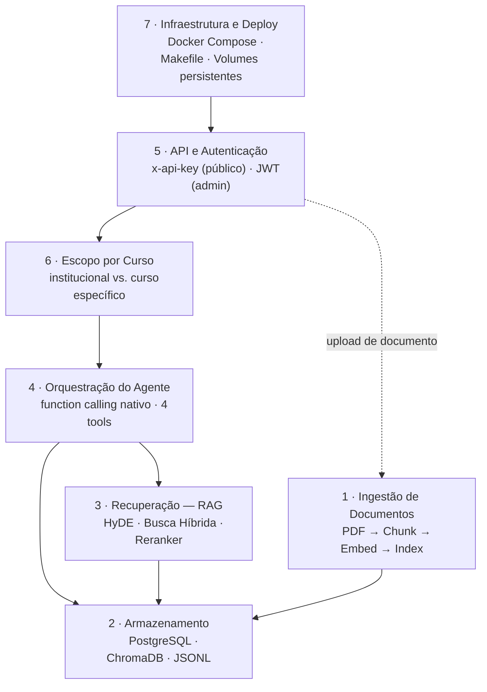

**Como ler este diagrama:** uma pergunta do usuário entra pela Camada 5 (autenticada), passa pela Camada 6 (que decide se o escopo é institucional ou de um curso específico), chega à Camada 4 (o agente decide quais fontes consultar), que aciona a Camada 3 (para conteúdo normativo em prosa) e consulta a Camada 2 diretamente (para dado estruturado). A Camada 1 só entra em ação quando um documento novo é enviado (fluxo de admin, não de chat). A Camada 7 hospeda e persiste tudo isso.

---

## 2. Metodologia Aplicada

O desenvolvimento seguiu um ciclo iterativo por fase, próximo de Design Science Research (DSR): cada fase teve diagnóstico → planejamento aprovado explicitamente → implementação → verificação contra o sistema **rodando de verdade** (não apenas testes unitários) → documentação → decisão sobre a próxima fase.

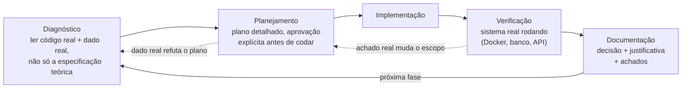

O ciclo tem dois pontos de retroalimentação que **de fato ocorreram** durante o projeto, não são apenas teóricos:

| Momento | O que aconteceu | Efeito no ciclo |
|---|---|---|
| Fase 3 (Corpo Docente) | O plano previa vínculo professor↔curso via `Discipline`/`ProfessorDiscipline`; o dado real fornecido (texto livre de área de atuação) não sustentava essa estrutura | Retorno de **Planejamento → Diagnóstico**: o modelo `Professor` foi redesenhado para ter `course_id`/`area` diretamente |
| Fase 5 (PPC + Calendário) | O plano inicial dividia o PPC manualmente em 6 PDFs antes do upload; o usuário apontou que isso não generalizava para documentos futuros (Manual do Aluno, etc.) | Retorno de **Planejamento → Diagnóstico**: redesenho para chunking roteado por bloco dentro do próprio `chunk_document()`, eliminando divisão manual |
| Fase 5a (verificação) | Testando o RAG sobre o PPC, uma pergunta sobre pré-requisitos de uma disciplina recebeu resposta parcialmente errada | Retorno de **Verificação → Implementação**: criação do `DisciplineTool` (não estava no plano original da fase) |
| Fase 6 (planejamento) | Cruzar o comportamento do filtro `course_id` com o dado real já semeado (calendário 100% institucional) revelou que a semântica planejada zeraria respostas de calendário | Corrigido **antes** de implementar (acionado no próprio Diagnóstico, não precisou de retrabalho) |

**Princípio consistente em todas as fases:** verificação sempre contra o sistema real (containers Docker, banco populado, chamadas HTTP reais), nunca apenas contra a leitura do código. Isso é o que permitiu capturar, ao vivo, uma alucinação parcial real (Fase 5a) e um bug silencioso que só se manifestaria em produção (Fase 6) — ambos antes de "fechar" a fase como concluída.

---

## 3. Camada 1 — Ingestão de Documentos

Transforma um PDF enviado pelo admin em conteúdo pesquisável — automaticamente, sem código novo por documento, mesmo quando o documento mistura texto normativo estruturado com prosa livre (achado real: o PPC de Engenharia de Computação tem as duas coisas no mesmo arquivo).

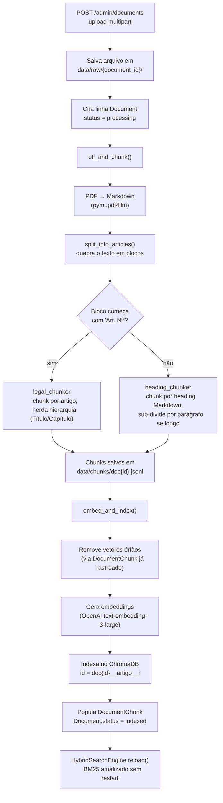

### Decisões estratégicas desta camada

- **Roteamento de chunking por bloco, não por documento inteiro** — a decisão central desta camada. Em vez de classificar o documento inteiro como "normativo" ou "prosa", cada bloco de texto é avaliado individualmente. Isso resolveu o caso real do PPC (144 páginas: ~110 de prosa + o Capítulo 6 estruturado por artigo) sem exigir divisão manual do arquivo, e generaliza para qualquer documento futuro (ex.: Manual do Aluno) sem código novo.
- **IDs de chunk namespaced por `document_id`, não por nome de arquivo** — corrige um bug real da v1 (dois PDFs distintos com o mesmo `filename`, em pastas diferentes, sobrescrevendo os chunks um do outro). Como `document_id` é chave primária, é único por construção.
- **BM25 recarregado via `reload()` ao final da indexação** — corrige a staleness do índice esparso (na v1, só via um restart do processo). Fecha o requisito "documento disponível para consulta logo após o upload".
- **Limpeza de vetores órfãos apenas para documentos já rastreados via `DocumentChunk`** — evita apagar vetores de *outro* documento por engano quando dois documentos compartilham o mesmo `source` (o mesmo bug de colisão de nome mencionado acima).
- **Upload síncrono, sem fila assíncrona** — o pipeline completo roda dentro do próprio request HTTP. Decisão dimensionada para o volume atual (dezenas de documentos); revisável isoladamente se o tempo de resposta se tornar um problema.
- **Falha de ingestão não derruba o upload** — se o ETL falhar, o documento fica registrado com `status="failed"` (rastreável, correções possíveis) em vez de a requisição HTTP simplesmente retornar erro 500 e o upload "sumir".

---

## 4. Camada 2 — Armazenamento

Combina três armazenamentos com papéis distintos e complementares — nenhum duplica os outros:

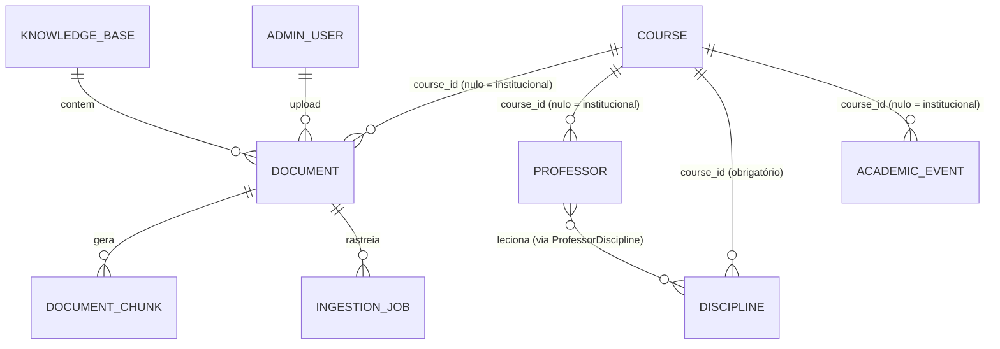

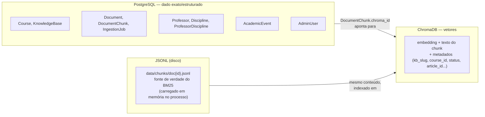

### Decisões estratégicas desta camada

- **`DocumentChunk` guarda só o `chroma_id`, não o texto do chunk** — o texto e o vetor vivem no ChromaDB; a tabela relacional serve só para rastrear "quais vetores pertencem a qual documento", permitindo limpeza precisa em reindex.
- **`course_id` nullable com semântica "institucional"** — em `Document`, `Professor` e `AcademicEvent`, `course_id = NULL` significa "vale para todos os cursos" (ex.: Estatuto, a maior parte do calendário acadêmico), não "sem curso definido". `Discipline.course_id` é a única exceção — não é nullable, porque uma disciplina sempre pertence a exatamente um curso.
- **Um único módulo `src/db/models.py`** para as 9+1 entidades, em vez de um arquivo por entidade — decisão de baixo custo e reversível, seguindo o padrão já estabelecido no projeto de módulos enxutos.
- **Motor de banco com conexão preguiçosa (`create_engine` só conecta no primeiro uso)** — permite que a adição do Postgres seja comprovadamente aditiva: o resto da API sobe e funciona normalmente mesmo com o Postgres fora do ar, contanto que a rota acessada não dependa dele.
- **Deduplicação por `storage_path`, não por `filename`** — mesmo motivo da Camada 1: nomes de arquivo não são garantidamente únicos no corpus real.

---

## 5. Camada 3 — Recuperação (RAG)

Pipeline herdado da v1 (não reescrito na v2), usado quando a pergunta precisa de conteúdo normativo em prosa (estatutos, regimentos, resoluções, seções narrativas do PPC).

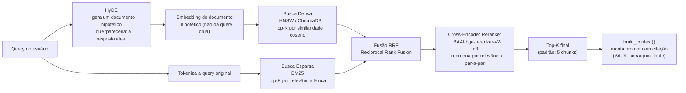

### Decisões estratégicas desta camada (herdadas da v1, mantidas na v2)

- **Busca híbrida (dense + BM25 via RRF), não só busca vetorial** — termos técnicos exatos (ex.: "Art. 45", siglas de programas) são melhor recuperados por BM25; a intenção semântica da pergunta é melhor capturada pelo dense. RRF funde os dois rankings sem precisar calibrar pesos manualmente.
- **HyDE para a busca densa** — gera um documento hipotético e busca pela similaridade *dele*, não da query crua — reduz o desalinhamento entre a forma de uma pergunta coloquial e a forma de um texto normativo formal.
- **Two-stage retrieval com Cross-Encoder** — recupera um conjunto amplo (top-50) priorizando recall, depois reordena com um modelo que avalia o par (query, documento) simultaneamente, reduzindo para o top-5 que de fato vai ao LLM.
- **Filtro de documentos revogados por padrão** (`filter_revoked=True`) — evita citar uma norma tecnicamente correta, mas revogada, como se estivesse vigente.
- **Pendência conhecida:** o parâmetro `score_threshold` do reranker existe no código mas não é aplicado por padrão — calibrá-lo exige medir a distribuição real de scores do `BAAI/bge-reranker-v2-m3` (não é garantidamente normalizado 0–1 como o Cohere Rerank que a metodologia do TCC I assumia). Registrado como item pendente, não implementado às cegas.

---

## 6. Camada 4 — Orquestração do Agente

O núcleo da evolução v1 → v2: a decisão "buscar ou não" (um JSON parseado manualmente na v1) virou *function calling* nativo da OpenAI, com um registro de ferramentas extensível.

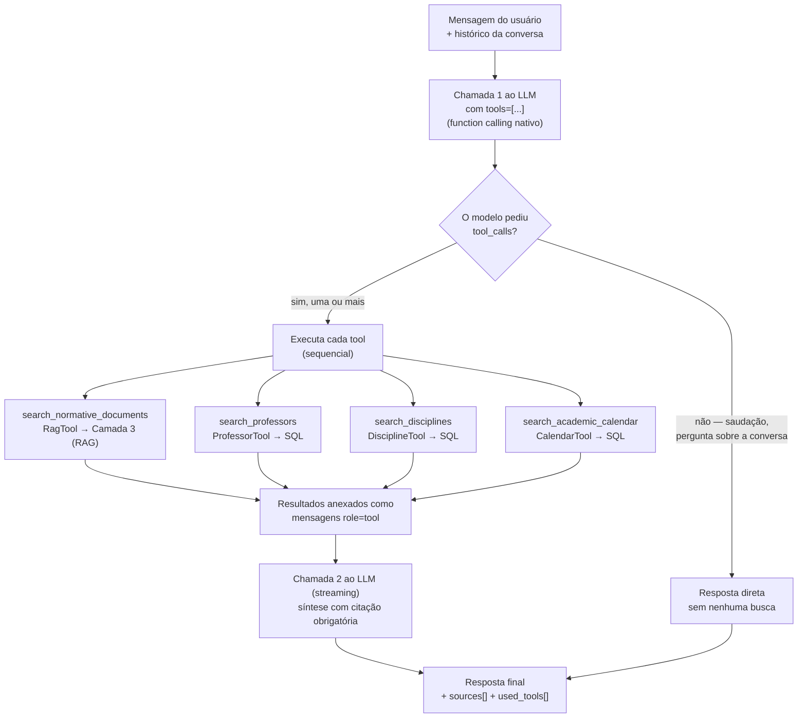

### Decisões estratégicas desta camada

- **Contrato uniforme de tool** — toda ferramenta expõe `NAME`, `SCHEMA` (JSON Schema da OpenAI) e `execute(arguments, context) -> {"summary": str, "sources": list[dict]}`. Isso torna o orquestrador agnóstico de quantas/quais tools existem — adicionar uma nova fonte de dado é registrar um módulo a mais, não modificar a lógica de decisão.
- **Uma função geradora única (`run()`)**, consumida tanto pelo caminho streaming quanto não-streaming — elimina a duplicação de lógica que existia entre `run_chat`/`stream_chat` na v1 (parsing de decisão, montagem de contexto e de fontes copiados quase literalmente em dois lugares).
- **O agente pode combinar múltiplas ferramentas na mesma resposta** — validado com uma pergunta real sobre o NDE (Núcleo Docente Estruturante), que envolve tanto uma norma (a Resolução que regulamenta o NDE) quanto quem o compõe (dado estruturado de professor).
- **Sessão do banco gerenciada dentro do próprio generator, não via injeção de dependência do FastAPI** — necessário porque, com respostas em streaming, o generator só é consumido *depois* que a função da rota já retornou; uma sessão injetada via `Depends` seria fechada cedo demais.
- **Princípio "fato exato → SQL/Tool, prosa → RAG" aplicado e validado empiricamente três vezes** — ver seção 11 (achado central).

---

## 7. Camada 5 — API e Autenticação

Dois esquemas de autenticação **completamente independentes**, cada um com seu propósito:

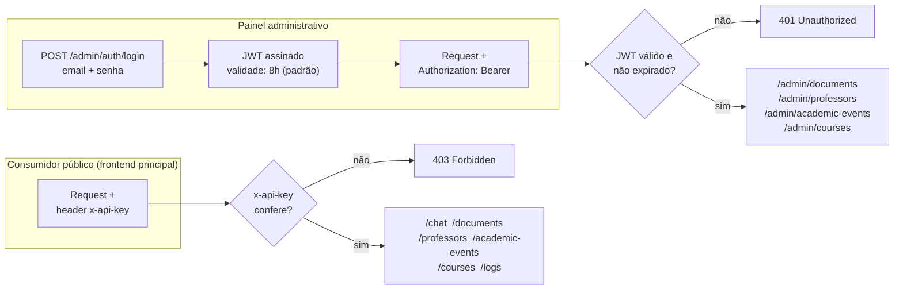

### Decisões estratégicas desta camada

- **Dois esquemas separados por design, não por falta de tempo** — a `x-api-key` protege o consumo público (demonstração/avaliação, sem sistema de usuários — decisão herdada da v1, fora de escopo acadêmico ter um sistema de contas completo). O JWT existe só para autenticar quem tem permissão de **escrever** conteúdo (upload de documentos, cadastro de professores/disciplinas/eventos/cursos).
- **Segredo do JWT com fallback seguro** — se `JWT_SECRET` não for configurada, a aplicação gera uma aleatória em memória no start (com aviso no log) em vez de usar um valor previsível. Efeito colateral aceito: reiniciar o processo invalida todas as sessões de admin — solucionável fixando a variável em produção.
- **Upload síncrono** (já mencionado na Camada 1) é também uma decisão desta camada: o cliente HTTP espera o pipeline inteiro terminar antes de receber a resposta.

---

## 8. Camada 6 — Escopo por Curso

Adicionada por último no roadmap (Fase 6) porque a maior parte da infraestrutura de `course_id` já existia, sem uso — esta camada só "fechou o circuito" do topo (`ChatRequest`) até o fundo (`ChromaDB`/BM25).

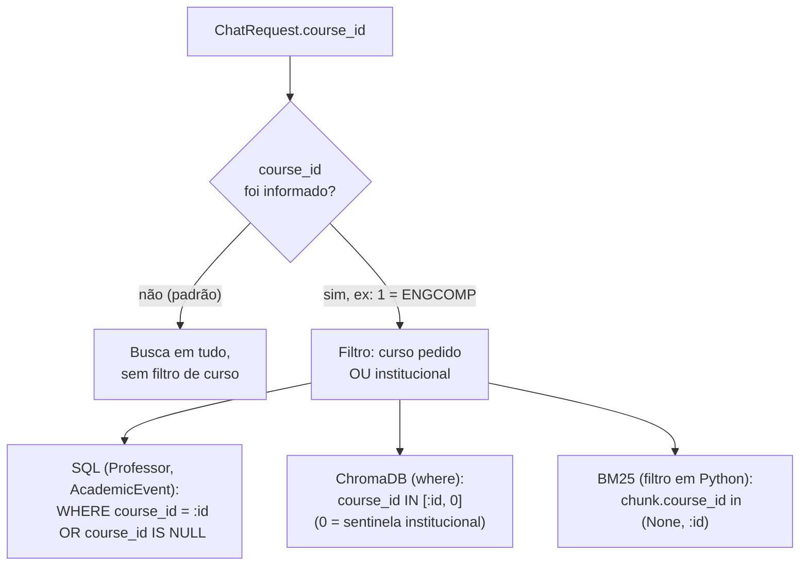

### Decisão estratégica desta camada (e o achado que a motivou)

A semântica "curso pedido OU institucional" — em vez de só "curso pedido" — não estava óbvia no plano original, e foi corrigida **antes** de implementar, ao cruzar o comportamento do filtro com o dado real já semeado: praticamente todos os eventos do calendário acadêmico e a maioria dos documentos normativos têm `course_id = NULL` (institucional). Um filtro ingênuo (`WHERE course_id = :id`) excluiria silenciosamente todo esse conteúdo assim que qualquer curso fosse selecionado — uma regressão que só apareceria em produção, sem nenhum erro visível (a pergunta simplesmente voltaria "não encontrado"). Este é um exemplo direto de como investigar o **estado real dos dados** antes de implementar uma feature evita uma classe inteira de bug silencioso.

---

## 9. Camada 7 — Infraestrutura e Deploy

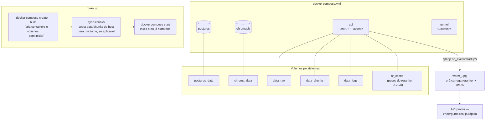

### Decisões estratégicas desta camada

- **Volumes persistentes para todo dado gerado em runtime** (`data_raw`, `data_chunks`, `data_logs`, `hf_cache`) — sem isso, um rebuild do container (rotina em qualquer deploy) perderia documentos enviados via admin e forçaria o BM25 a degradar silenciosamente para busca só-densa, ou re-baixar ~2.2GB de pesos do reranker a cada rebuild.
- **Pré-carregamento (warm-up) do reranker no startup do processo**, não na primeira pergunta de um usuário real — o custo de carregar o modelo (segundos com pesos em cache; minutos numa máquina nova) passa a ser pago pelo container subindo, nunca por quem está usando o chat.
- **Automação via Makefile como camada fina sobre Docker Compose** — `make bootstrap` (instalação nova), `make backup`/`make restore` (migração entre máquinas via volumes), `make deploy` (atualização contínua com migrations do Alembic aplicadas automaticamente) — operacionaliza o `DEPLOY.md` sem duplicar lógica entre documentação e scripts.
- **Cloudflare Tunnel em vez de expor porta direta** — decisão herdada da v1, mantida: sem necessidade de configurar firewall/NAT, TLS gerenciado pelo Cloudflare, viável mesmo atrás de CGNAT/rede residencial.

---

## 10. Síntese — Tabela de Decisões Estratégicas

| # | Decisão | Camada | Fonte | Validação empírica |
|---|---|---|---|---|
| D1 (v1) | Chunking por artigo (semântico-hierárquico) | 1 | `EVOLUTION.md` | Herdada, mantida |
| D2 (v1) | Busca híbrida (dense + BM25 + RRF) | 3 | `EVOLUTION.md` | Herdada, mantida |
| D3 (v1) | Cross-Encoder reranker (two-stage) | 3 | `EVOLUTION.md` | Herdada, mantida |
| D4 (v1) | Filtro de documentos revogados | 3 | `EVOLUTION.md` | Herdada, mantida |
| D9 (v1) | Professores: curadoria manual, dado estruturado | 2/4 | `EVOLUTION.md` | Origem do princípio validado 3x (seção 11) |
| BM25 staleness (D1 diagnóstico) | `reload()` após ingestão, sem restart | 1 | `PLANO_V2.md` | Confirmado: doc processado aparece em busca esparsa sem reiniciar o processo |
| Chunks órfãos (D2 diagnóstico) | Limpeza precisa via `DocumentChunk` no reindex | 1/2 | `PLANO_V2.md` | Confirmado: reindex não duplica nem deixa vetor fantasma |
| Duplicação run_chat/stream_chat (D4 diagnóstico) | Uma função geradora única (`orchestrator.run()`) | 4 | `PLANO_V2.md` | Confirmado: mesmo evento alimenta os dois formatos de saída |
| Decisão binária → function calling (D5 diagnóstico) | Function calling nativo da OpenAI | 4 | `PLANO_V2.md` | Confirmado: múltiplas tools combináveis numa mesma resposta |
| Sem conceito de curso (D9 diagnóstico) | `course_id` opcional + semântica institucional | 6 | `PLANO_V2.md` | Confirmado: isolamento entre cursos sem quebrar conteúdo institucional |
| D10 | Um único `models.py` para todas as entidades | 2 | `EVOLUTION_V2.md` (Fase 0) | — |
| D11 | Postgres via Docker + engine preguiçoso | 2 | `EVOLUTION_V2.md` (Fase 0) | Confirmado: API sobe normalmente com Postgres fora do ar |
| D13/D15 | Deduplicação/namespace por chave real, não por nome de arquivo | 1/2 | `EVOLUTION_V2.md` (Fases 0/1) | Confirmado: bug de colisão de nome fechado estruturalmente |
| D16 | Limpeza de vetores só para docs já rastreados | 1 | `EVOLUTION_V2.md` (Fase 1) | Prevenido antes de rodar em produção |
| D18/D19 | Upload síncrono; falha de ingestão não derruba o upload | 1/5 | `EVOLUTION_V2.md` (Fase 2) | Confirmado via ciclo completo de upload/reindex/delete |
| Contrato uniforme de tool | `execute(arguments, context) -> {summary, sources}` | 4 | `EVOLUTION_V2.md` (Fase 4) | Reaproveitado sem alteração por 3 tools subsequentes |
| Sessão de banco no generator, não via `Depends` | Evita gotcha de streaming + FastAPI | 4/5 | `EVOLUTION_V2.md` (Fase 4) | — |
| Roteamento de chunking por bloco | `legal_chunker`/`heading_chunker` por bloco, não por documento | 1 | `EVOLUTION_V2.md` (Fase 5a) | Confirmado: PPC misto processado sem divisão manual |
| Fato exato → SQL, prosa → RAG (aplicação 2 e 3) | `DisciplineTool`, `CalendarTool` | 4 | `EVOLUTION_V2.md` (Fases 5a/5b) | Ver seção 11 |
| Semântica institucional (`course_id IS NULL`) | `OR course_id IS NULL` em todo filtro de escopo | 2/6 | `EVOLUTION_V2.md` (Fase 6) | Confirmado: calendário/professores institucionais continuam visíveis sob qualquer escopo |
| Warm-up do reranker no startup | Pré-carrega modelo antes do primeiro request real | 7 | Sessão de otimização de deploy | Confirmado: 85s (frio) → ~3s na primeira pergunta real |

---

## 11. Achado Central — RAG vs. SQL, Validado Empiricamente Três Vezes

O princípio arquitetural mais citado ao longo do desenvolvimento — **fato exato consultado via SQL/Tool, prosa consultada via RAG** — não foi apenas uma preferência de design declarada no planejamento (`PLANO_V2.md`, Seção 5). Foi testado e confirmado empiricamente em três domínios de dado diferentes, cada um a partir de uma pergunta real que o caminho puramente semântico (RAG) respondia com risco concreto de erro:

| Domínio | Pergunta de teste | Resposta via RAG (só semântica) | Resposta via Tool (SQL) | Fase |
|---|---|---|---|---|
| Corpo docente | "Quem é o professor X?" / "quem coordena o NDE?" | Risco de citar e-mail/área errados (busca semântica não garante correspondência exata) | Consulta SQL exata — resposta correta ou honestamente "não encontrado" | 3/4 |
| Matriz curricular | "Quais os pré-requisitos de Compiladores?" | **Errou de fato**: "Teoria da Computação e Estruturas de Dados" (incorreto) | Correto: "AED, LFA e OAC" — e 4x mais rápido (3,9s vs. ~17s) | 5a |
| Calendário acadêmico | "Quando é o trancamento de matrícula em 2026.1?" | Aproximação arriscada a partir de texto normativo genérico | Data exata: "6 a 10 de abril de 2026" | 5b |

O caso da matriz curricular é o mais forte para a monografia porque não é hipotético: foi um erro real, capturado ao vivo durante a verificação da Fase 5a, com causa raiz identificada (fato exato dependendo de recall de embedding sobre texto em prosa) e correção que **melhorou precisão e latência simultaneamente** — evidência de que a arquitetura "RAG para prosa, SQL para fatos exatos" não é apenas uma preferência teórica, mas uma correção mensurável de qualidade.
