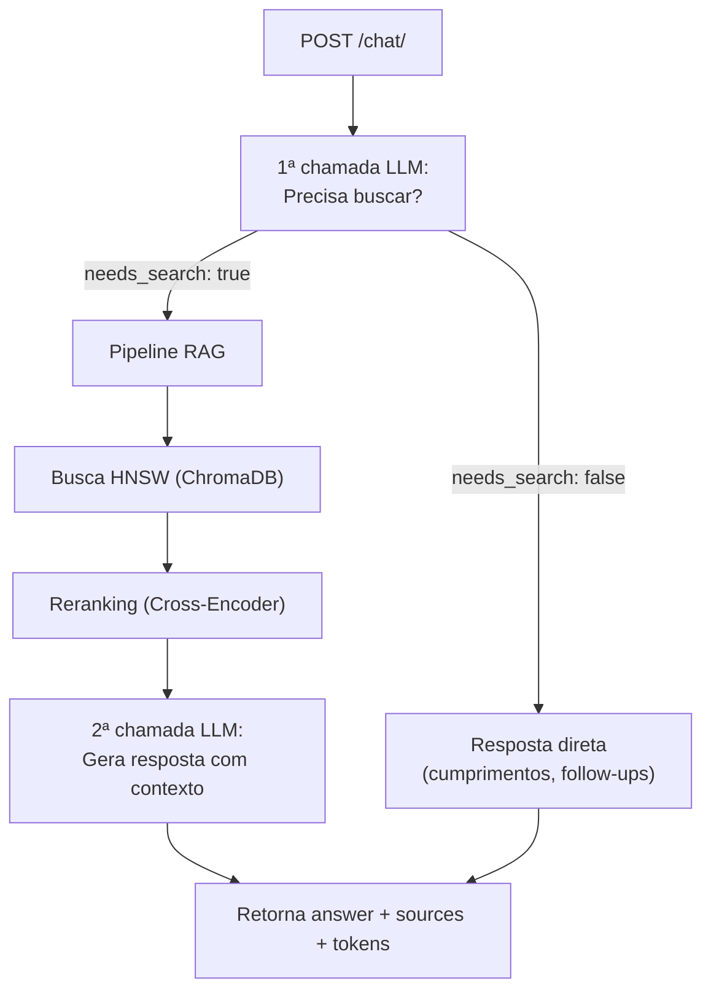

# Walkthrough — Sprint 1: FastAPI + Agente Leve de Chat

## O que foi feito

Migração do pipeline RAG para uma API REST com FastAPI, adicionando um **agente leve** que decide quando buscar nos documentos e quando responder diretamente.

### Arquivos criados

| Arquivo | Descrição |
|---|---|
| [main.py](file:///c:/Users/Usuario/Documents/projects/TCC/src/main.py) | Entrypoint FastAPI com CORS e health check |
| [chat/__init__.py](file:///c:/Users/Usuario/Documents/projects/TCC/src/chat/__init__.py) | Init do módulo chat |
| [chat/schemas.py](file:///c:/Users/Usuario/Documents/projects/TCC/src/chat/schemas.py) | Pydantic models (`ChatRequest`, `ChatResponse`, `SourceInfo`, etc.) |
| [chat/service.py](file:///c:/Users/Usuario/Documents/projects/TCC/src/chat/service.py) | **Agente leve** — decide buscar ou responder direto, com histórico |
| [chat/router.py](file:///c:/Users/Usuario/Documents/projects/TCC/src/chat/router.py) | Endpoint `POST /chat/` |

### Arquivo modificado

| Arquivo | Mudança |
|---|---|
| [pyproject.toml](file:///c:/Users/Usuario/Documents/projects/TCC/pyproject.toml) | Adicionadas deps: `fastapi`, `uvicorn[standard]`, `httpx` |

---

## Como o agente funciona



---

## Verificação

Servidor rodando: `uvicorn src.main:app --port 8000`

### Teste 1: Health Check ✅

```
GET /health → 200 { "status": "ok" }
```

### Teste 2: Cumprimento (sem busca) ✅

```json
// Request
{ "message": "Oi, bom dia!", "history": [] }
// Response
{ "answer": "Olá, bom dia! Como posso ajudar?", "used_search": false, "tokens": { "prompt": 243, "completion": 23 } }
```

### Teste 3: Pergunta sobre normas (com busca) ✅

```json
// Request
{ "message": "Como funciona o trancamento de matrícula?" }
// Response
{ "answer": "O trancamento de matrícula na UNIVASF...", "used_search": true, "sources": [...], "tokens": { "prompt": 2048, "completion": 116 } }
```

### Teste 4: Follow-up com histórico ✅

```json
// Request (com history preenchido)
{ "message": "E qual o prazo para solicitar?", "history": [{...}] }
// Response: 200 OK — agente buscou com contexto do histórico
```

---

## Próximos passos

- **Sprint 2**: Docker Compose (Dockerfile + docker-compose.yml + ChromaDB HTTP client)
- **Sprint 3**: Rewire Streamlit para chamar a API
